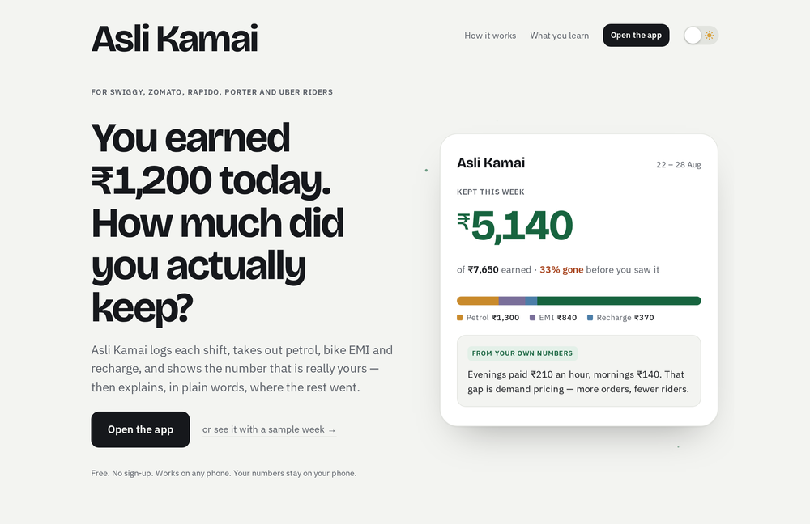
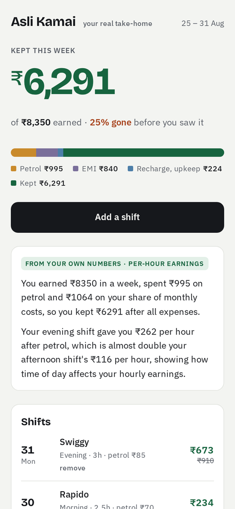

# Asli Kamai

**Your real take-home, explained from your own numbers.**

Asli Kamai is a financial-literacy coach for gig delivery and ride workers in India — Swiggy, Zomato, Rapido, Porter and Uber riders. You log one number per shift (the one already on your earnings screen), it takes out petrol, bike EMI and recharge, and shows what you actually kept — then an AI coach explains the numbers and teaches one money concept at a time, built only from your own week.

**Live: [asli-kamai.vercel.app](https://asli-kamai.vercel.app) · App: [asli-kamai.vercel.app/app/](https://asli-kamai.vercel.app/app/)**

| The site | The app |
| --- | --- |
|  |  |

## What it does

- **One number per shift.** Platform, slot, hours, gross, petrol — ten seconds after you park.
- **Kept this week.** Monthly costs (EMI, recharge, upkeep) are spread across your working days so every shift carries its share; the hero number is what is really yours.
- **Explain my pay.** An LLM receives your week's *computed* facts — never raw access to anything — and writes a plain-language explanation plus one lesson (gross vs net, surge pricing, fixed cost per day, compounding), quoting your own figures. The model never does the arithmetic, so the rupees always match the app.
- **Use first, sign in later.** The app is fully usable with no account; after ten shifts a Google sign-in keeps the record safe across phones. Data lives on the phone and syncs to the cloud once signed in.
- **Installable.** Add to home screen on Android and it opens full-screen as an app.

## What it deliberately does not do

- No login to any platform account, ever.
- No guessing or auditing how platforms calculate pay — the rider's own record is the only truth.
- No scraping. No SMS reading.

## Stack

- **Frontend:** React + Vite (TypeScript), two pages (`/` site, `/app/` PWA), no UI framework.
- **API:** Vercel serverless functions in `api/`, thin handlers over the modules in `server/` (Google ID-token verification, JWT sessions, ledger sync, LLM call). `server/index.js` runs the same modules as an Express server for local dev.
- **Database:** Postgres (`users`, `ledgers` — one JSON ledger per user).
- **AI:** Featherless (`Qwen/Qwen3-30B-A3B-Instruct-2507`) behind the `/api/explain` function.

## Run it locally

```bash
npm install
cp server/.env.example server/.env   # fill in values; DATABASE_URL optional (falls back to in-memory)
npm run dev:server                   # API on :8787
echo "VITE_API_URL=http://localhost:8787" > .env
npm run dev                          # site on :5173, app on :5173/app/
```

## Built for

The Prometheus SPEED September AI Challenges (educational AI tools), September 2026.
