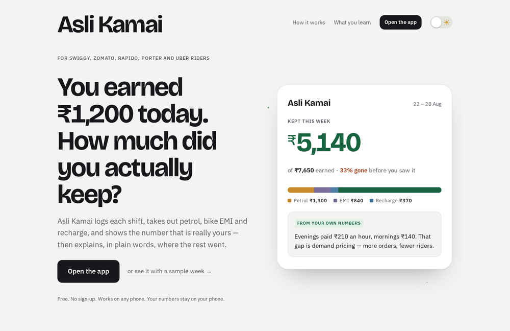
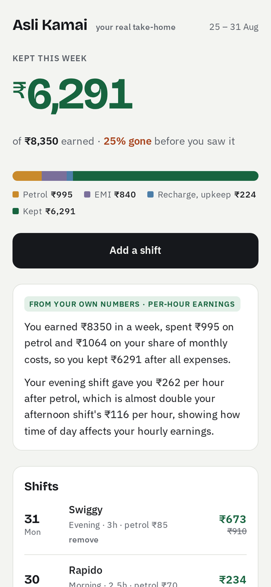

# Asli Kamai

**Your real take-home, explained from your own numbers.**

Asli Kamai is a financial-literacy coach for gig delivery and ride workers in India — Swiggy, Zomato, Rapido, Porter and Uber riders. You log one number per shift (the one already on your earnings screen), it takes out petrol, bike EMI and recharge, and shows what you actually kept — then an AI coach explains the numbers and teaches one money concept at a time, built only from your own week.

**Live: [asli-kamai.vercel.app](https://asli-kamai.vercel.app) · App: [asli-kamai.vercel.app/app/](https://asli-kamai.vercel.app/app/)**

| The site | The app |
| --- | --- |
|  |  |

## What it does

- **One number per shift, three ways in.** Type it; say it in Hindi, English or Hinglish ("Zomato shaam ko chaar ghante, gyarah sau kamaya, nabbe ka petrol"); or show a screenshot of the platform's earnings screen. A language model fills the form, the rider checks every field, and nothing is saved on the model's word.
- **Kept this week.** Monthly costs (EMI, recharge, upkeep) are spread across your working days so every shift carries its share; the hero number is what is really yours.
- **Kept this week, by week.** Step back through past weeks, see each day as a bar, and see this week against last.
- **Explain my pay.** An LLM receives the week's *computed* facts — never raw access to anything — and writes a plain-language explanation plus one lesson (gross vs net, surge pricing, fixed cost per day, cost per hour, week over week, a typical day), quoting the rider's own figures. The model never does the arithmetic, so the rupees always match the app.
- **Ask the coach.** A conversation grounded in the same facts: "Which app pays me best per hour?", "Can I afford a ₹4,500 EMI?", "How many hours tomorrow evening to keep ₹800?" Every answer shows its working from the rider's own record.
- **Weekly quiz.** Two questions on this week's numbers. The answers are computed by the app, the model only writes the question and the explanation, so a right answer is never marked wrong.
- **Goal.** A phone, a helmet, Diwali at home: put a number and a date on it and the app works out the daily amount from the rider's typical day, how many hours of their best slot it takes, and what a recurring deposit would add on top.
- **Hindi or English.** One tap switches the app's labels and every word the coach writes.
- **Use first, sign in later.** The app is fully usable with no account; after ten shifts a Google sign-in keeps the record safe across phones. Data lives on the phone and syncs to the cloud once signed in.
- **Installable.** Add to home screen on Android and it opens full-screen as an app.

## What it deliberately does not do

- No login to any platform account, ever.
- No guessing or auditing how platforms calculate pay — the rider's own record is the only truth.
- No scraping. No SMS reading.

## Stack

- **Frontend:** React + Vite (TypeScript), two pages (`/` site, `/app/` PWA), no UI framework.
- **API:** Vercel serverless functions in `api/`, thin handlers over the modules in `server/` (Google ID-token verification, JWT sessions, ledger sync, LLM call). `server/index.js` runs the same modules as an Express server for local dev.
- **Database:** Postgres (`users`, `ledgers` — one JSON ledger per user).
- **AI:** Featherless — `Qwen/Qwen3-30B-A3B-Instruct-2507` for the explanation, coach, quiz and spoken entry; `Qwen/Qwen3-VL-30B-A3B-Instruct` reads earnings screenshots. Every AI route receives only figures computed in `server/facts.js`, and the routes are rate-limited per IP.

## How AI is used in the app

- **Screenshot reading.** `Qwen/Qwen3-VL-30B-A3B-Instruct` reads an earnings screenshot and fills the shift form. The rider checks every field before it is saved.
- **Spoken entry.** The browser turns speech into text (Web Speech API); `Qwen/Qwen3-30B-A3B-Instruct-2507` turns that text into the same form fields.
- **Explanation, coach and quiz.** The same model writes the plain-language explanation, the coach's answers and the quiz wording.
- **What the model never does.** Every rupee figure, per-hour rate, average and quiz answer is computed in plain code in `server/facts.js`. The model only receives those finished figures and puts them into words, so it cannot invent a number. It never sees an account, a login or any data beyond the rider's own week.
- **Provider.** Both models are served through Featherless. Calls go through the server, the key never reaches the browser, and every AI route is rate-limited per IP.

## Credits

- [React](https://react.dev) and [Vite](https://vite.dev) for the frontend, [TypeScript](https://www.typescriptlang.org).
- [node-postgres](https://node-postgres.com) for the database, [google-auth-library](https://github.com/googleapis/google-auth-library-nodejs) and [@react-oauth/google](https://github.com/MomenSherif/react-oauth) for Google sign-in, [jsonwebtoken](https://github.com/auth0/node-jsonwebtoken) for sessions.
- [Qwen3](https://github.com/QwenLM/Qwen3) and [Qwen3-VL](https://github.com/QwenLM/Qwen3-VL) models by the Qwen team, served by [Featherless](https://featherless.ai).
- Hosting on [Vercel](https://vercel.com); Postgres on [Render](https://render.com).

## Run it locally

```bash
npm install
cp server/.env.example server/.env   # fill in values; DATABASE_URL optional (falls back to in-memory)
npm run dev:server                   # API on :8787
echo "VITE_API_URL=http://localhost:8787" > .env
npm run dev                          # site on :5173, app on :5173/app/
```

## Built for

Riders in India, first. It started as a hackathon entry in an educational-AI series in September 2026.
